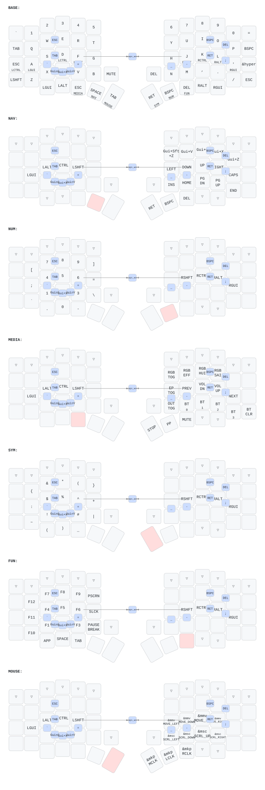

# Sofle ZMK Keymap

Split ergonomic keyboard (60 keys + 2 rotary encoders) running [ZMK firmware](https://zmk.dev) on Nice!Nano v2.
Miryoku-style layout adapted from my [Corne config](https://github.com/dieselsaurav/zmk-for-keyboards).

## Keymap

Auto-generated from [`config/sofle.keymap`](config/sofle.keymap) via [keymap-drawer](https://github.com/caksoylar/keymap-drawer):



The SVG updates automatically on push via the [Draw Keymap](.github/workflows/draw-keymap.yml) workflow.

### Layers

| # | Name  | Activated by      |
|---|-------|-------------------|
| 0 | BASE  | default           |
| 1 | NAV   | hold inner-left SPACE  |
| 2 | NUM   | hold inner-right BSPC  |
| 3 | MEDIA | hold left ESC thumb    |
| 4 | SYM   | hold inner-right RET   |
| 5 | FUN   | hold right DEL thumb   |
| 6 | MOUSE | hold left TAB thumb    |

QWERTY base with **GACS home-row mods**, **vim arrows** (HJKL) on NAV, a top number row, and 14 combos (esc, tab, bspc, del, enter, copy/cut/paste, caps-word, and vertical symbol combos for `- _ = \` ;`).

## Display

- **Left (central):** Built-in ZMK status screen (layer, battery, BT)
- **Right (peripheral):** Custom P keycap logo with glitch effects + battery + BT status

## Encoders

- **Left:** Volume up/down (RGB brightness on the MEDIA layer)
- **Right:** Page up/down

## Interactive Viewer

```sh
make viewer
```

Press `?` for the cheat sheet. Press `0-6` to switch layers.

## Build Firmware

Push to `config/` or `build.yaml` triggers the [Build ZMK firmware](.github/workflows/build.yml) workflow. Download `.uf2` files from Actions artifacts.

The default build is the **OLED** variant (full encoder + RGB + custom display). Nice!View variants are also built — note that on Sofle the nice!view display shares pin `P0.20` with the rotary encoder, so the encoder is disabled on those builds.

## Regenerate Keymap SVG

```sh
make install   # one-time: pip install keymap-drawer
make svg       # parse + render SVG
```

## Hardware

- **Board:** Nice!Nano v2 (nRF52840)
- **Shield:** Sofle (split, 6x4 + 5-key thumb cluster + encoder per half)
- **Display:** OLED SSD1306 128x32 / Nice!View
- **RGB:** 36 WS2812 LEDs
- **Encoders:** 2x EC11 rotary
- **Bluetooth:** 4 profiles
- **ZMK Studio:** Enabled
- **Mouse/Pointing:** Enabled
